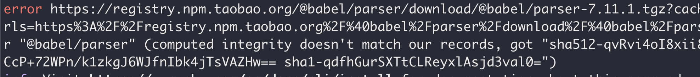

### 遇到的问题

computed integrity doesn't match our records

### 解决方案：

1. 删除 yarn.lock 中报错依赖信息

- 比如上述报错信息中的@babel/parser

2. 执行 yarn 重新安装依赖，用于更新@babel/parser 相关的信息即可。

#### 错误的尝试：

1. 使用`yarn cache clean`
   - 清除缓存并不能解决这个问题，反而导致安装依赖的速度更慢了。
2. `yarn install --update-checksums`
   - 这样的话会更新 lock 文件中的所有模版的信息，比较简单粗暴。

#### 为什么会这样：

> 还在观察中，具体还不知道原因。因为部分人电脑正常，yarn 版本也是一致的，所以就很奇怪了。
