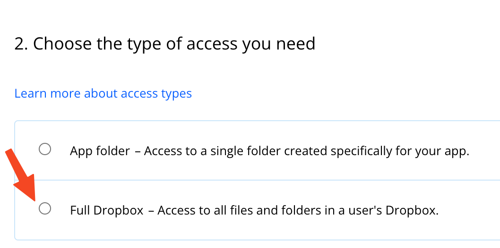
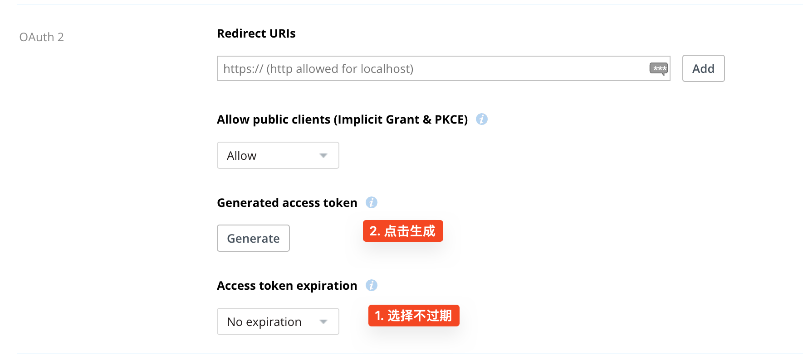

# 生成 Instapaper 的 rss 源文件

### 背景

- 目前在使用[instapaper](https://www.instapaper.com/)来收藏日常看的文章，为了方便把自己喜欢的内容共享给其他人，所以利用`instapaper`的 api 来自动生成`Rss`源。
- `Vercel`不能执行定时任务，同时`Api`限制 10s 的超时，导致实时计算`rss`的方案失败。

### 准备工作

1. [申请](https://www.instapaper.com/main/request_oauth_consumer_token)`Instapaper`的 Api。
2. [配置](https://www.dropbox.com/developers/apps) `Dropbox`的 App。

### 技术思路

1. 使用`Instapaper`的 Api 获取已收藏的文章列表。
2. 使用[Feed](https://www.npmjs.com/package/feed)库生成 xml 文件，写入 xml 文件到`Dropbox`。
3. 通过`Github Action`的`schedule`每天 0 点更新一下内容。
4. 访问`instapaper.xml`资源的时候从`Dropbox`下载。

### 模块依赖

1. [Dropbox](https://www.npmjs.com/package/dropbox)：官方 SDK，用于上传和下载文件。
2. [Rss](https://www.npmjs.com/package/rss)：用于把文章 json 转换成 rss 文件。
3. [Instapaper-node-sdk](https://www.npmjs.com/package/instapaper-node-sdk)：第三方 Instapaper 的 SDK。

### 详细流程

1. 获取完整`Instapaper`数据：

   > 为了避免触发`Instapaper`的频繁调用报错，下面的内容获取都设置了 1s 的延时获取。

   - 使用`listFolders`获取目录列表。
   - 使用`list`获取目录中的文章列表。
   - 使用`getText`获取文章的 dom 文本（用于 rss 的预览）。

2. 转化数据为`rss`文件：
   - 使用`rss`的`addItem`方法即可。
3. 上传文件到`Dropbox`:
   - 上传步骤 1 的 json：用于缓存控制，后续的获取进读取新的文章数据即可。
   - 上传步骤 2 的 rss 文件
4. 博客配置：
   - 添加 api 接口：`/api/instapaper`:被动从`Dropbox`获取最新的 rss 文件。
   - 配置重定向规则（保持和之前的地址不变）：`/instapaper` -> `/api/instapaper`。
5. 配置`Github Action`：
   - 触发规则：`main`的推送、每日 0 点定时任务。
   - 执行脚本：步骤 1-3 的流程。

### 遇到的问题

1.  Dropbox 获取到的`access_token`会过期：以`sl`开头

    解决方法：

    - 创建 App 的时候选择`Full Dropbox`
      

    - 获取`access_token`
      

2.  `Instapaper`的`Secret`无法生效。

    问题原因：

    - 配置.env.local 的时候时候，习惯给 value 添加了双引号 🤪，导致一直鉴权失败了。
    - `Instapaper`的文档特别难懂，缺少 Demo 无法自主验证，只能使用第三方 sdk。

3.  `Vercel`无法执行定时任务。

    解决方法：使用`Github Action。

4.  `Vercel`的`Api`有 10s 超时限制。

    解决方法：使用 Github Action`。

5.  `Dropbox`接口报错：missing_scope。

    解决方法：

         - [参考](https://github.com/andreafabrizi/Dropbox-Uploader/issues/514#issuecomment-711345756)
         - 删除App、配置`file.contents.write`权限、重新生成`access_token`即可。

### 参考资料

1. [Instapaper Api](https://www.instapaper.com/api)
2. [Dropbox Api](https://www.dropbox.com/developers/apps/)
