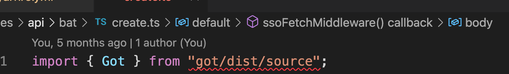

# 你不知道的 Yarn

### 前言

使用 Yarn 好多年了，常用的命令也只有：`yarn install`、`yarn add`、`yarn why`这几个命令。最近查看`redux-toolkit`的源码，pkg 里面使用的`resolutions`和`patch`协议挺有趣的，所以近期又抽空阅读了一下`yarn`的文档，整理了一些感兴趣的知识点。

### 知识点

1. `resolutions`：强制所有包使用同一个版本， [参考](https://yarnpkg.com/configuration/manifest#resolutions)。
2. `patch`协议：使用补丁修复第三方模块的代码文件，[参考](https://yarnpkg.com/features/protocols/#patch)。
3. `pnp`特性：node 的一种新的安装策略，不再生成`node_modules`目录了，提供了自定义的模块索引功能，[参考](https://yarnpkg.com/features/pnp)。

### 遇到的问题

1. 配置私有的`scope`后提示错误：`Unsafe http requests must be explicitly whitelisted in your configuration`

   解决方法：配置 unsafeHttpWhitelist 字段即可，不需要协议头。

   ```yaml {4-5}
   npmScopes:
     shuwen:
       npmRegistryServer: 'http://registry.npm.xxx.com'
   unsafeHttpWhitelist:
     - 'registry.npm.xxx.com'
   ```

2. 无法开启`pnp`

   跟着官网的[升级教程](https://yarnpkg.com/getting-started/migration)步骤配置完以后发现`pnp`一直无法启动，配置了`installConfig.pnp`也不行。

   解决方法：仔细阅读了文档，发现近需要移除`.yarnrc.yml`中的`nodeLinker: node-modules`即可。

3. `next.js`项目开启`pnp`后，部署到服务器启动失败。

   待解决。

4. `vscode`中提示无法找到项目的依赖声明文件。
   

   待解决。
